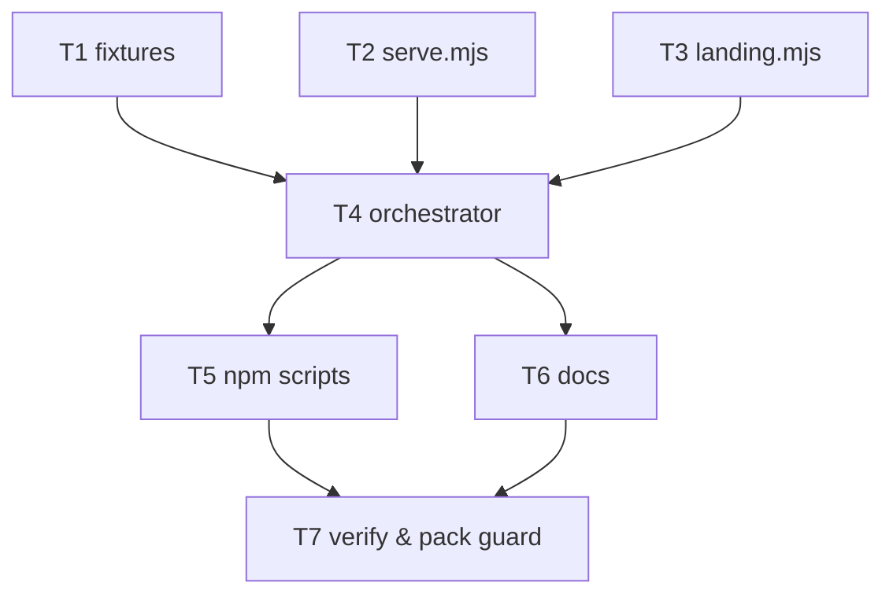

# Plan: Add runnable demo site showcasing QMetriX capabilities
> Task: 1-demo-site | Issue: #1 | Date: 2026-06-30 | Priority: Normal | Total estimate: ~1.5–2 days (7 subtasks)

## Task Breakdown
| ID | Subtask | Estimate | Complexity | Risk | Depends on | Covers |
| --- | --- | --- | --- | --- | --- | --- |
| **T1** | **Sample report fixtures** — `dev/demo/fixtures/reports/**`: 3 Istanbul `coverage-summary.json` (unit/e2e/global), 2 SARIF 2.1.0 (`snyk-deps.sarif`, `qmetrix-codeql.sarif`), `npm-audit.json`, `npm-outdated.json`. Shapes matched to `coverage.mjs` / `security.mjs`. **No coverage `index.html`.** | S | routine | low–med | — | FR-3; AC-3 (data) |
| **T2** | **Static server** — `dev/demo/serve.mjs`: `node:http` file server, MIME map, dir→`index.html`, base port + auto-increment on `EADDRINUSE`, prints URL. | S | routine | low | — | FR-4; AC-4 (+ port edge) |
| **T3** | **Landing generator** — `dev/demo/landing.mjs`: builds `index.html` (intro, **illustrative-sample-data disclaimer**, links to dashboard/bundle/duplication/raw JSON, stats strip from `dashboard.json`+`jsinspect.json`). | S | routine | low | — | FR-7; AC-7; R3 disclaimer |
| **T4** | **Orchestrator** — `dev/demo/run.mjs`: clean → seed fixtures → spawn `audit-structure` + `quality-dashboard --out dist/site/dashboard.html` (via `process.execPath`, `cwd=ROOT`) → copy `jsinspect.json` into `dist/site/` → render landing → serve. CLI `[--no-serve] [--port] [--open]`. | M | complex | **med** | T1, T2, T3 | FR-1/2/5/6; AC-1/2/6/8; NFR-3/5/6/7 |
| **T5** | **npm wiring** — `package.json`: add `scripts.demo` + `scripts.demo:build`. `files`/`dependencies`/`engines` untouched. | S | trivial | low | T4 | AC-1; AC-10 (deps) |
| **T6** | **Docs** — `dev/demo/README.md` (what/why, disclaimer, Pages publish), `CLAUDE.md` (§3 layout row + §8 command), `README.md` (Demo section). | S | trivial | low | T4 | FR-5 (how-to); R1/R3 docs |
| **T7** | **Verify & packaging guard** — (opt) `dev/demo/check.mjs` (assert 5 served files exist; grep emitted HTML for `href="../"`/`localhost`/abs paths), wired into `demo:build`. Then full gate: `npm run demo` (serve+open), offline run, run twice (idempotency), open `dist/site/index.html` from filesystem, `npm pack --dry-run` (only `src/`), `git diff package.json` deps unchanged. | S–M | routine | low | T4, T5, T6 | AC-5/6/8/9/10 (final) |

*All ≤ M — no subtask reaches L.*

## Dependency Graph

## Execution Order & Milestones
- **M1 — Parallel foundation:** T1, T2, T3 are mutually independent (data, server, template) → do concurrently. Each is independently committable.
- **M2 — Integration (critical):** T4 wires them into a working `node dev/demo/run.mjs`. **Demo is functional here.** This is the risk-bearing step (relative-link self-containment, idempotent clean, cwd) — front-loaded immediately after M1.
- **M3 — Surface & document:** T5 (npm alias) + T6 (docs) in parallel.
- **M4 — Verification gate:** T7 proves ACs and the packaging boundary; closes the task.

**Critical path:** `{T1 | T2 | T3} → T4 → T5 → T7` (T6 runs parallel to T5, also feeding T7). T4 is the longest single node and the integration risk concentrator.

## Backlog Placement
**Recommendation: Priority Normal — do now.** Justification:
- **Unblocked & self-contained.** Per the design, #1 runs the bins itself and seeds samples; it has **no hard dependency** on #2, and it sits **outside** the `#3 → {#6, #8, #9}` maintainability chain.
- **No file conflicts.** Only open PR is **#10** (`chore/task-reference-screenshots`), which touches `dev/tasks/{5..9}/` intake docs + screenshots only — **disjoint** from this task's files (`dev/demo/**`, `package.json`, `CLAUDE.md`, `README.md`). Safe to proceed in parallel; no coordination needed.
- **De-risks #2.** Dogfooding the bins end-to-end against this repo is exactly what #2 needs; doing #1 first surfaces any cwd/consumer-assumption bugs early (synergy noted in requirements).
- **Type/priority:** enhancement (feature) at Normal; among the all-Normal backlog, this is a high-leverage, low-dependency feature → ahead of the UI chain (#5–#9, several of which wait on #3) and natural to pair with #2.

**Suggested sitting order across the board:** #1 (this) and/or #3 (unblocks the most) first → #2 → then the #3-dependent UI work.

## Schedule Risks
| Risk | Impact | Mitigation |
| --- | --- | --- |
| **Self-containment regression** (a stray `../reports/…` or absolute link breaks Pages) — concentrated in T4 | Pages deploy silently broken | T4 uses default `--out` (yields `../reports`, which we avoid by **not** seeding coverage `index.html`); T7 `check.mjs` greps emitted HTML and fails the build |
| **Sample-shape mismatch** (T1 JSON/SARIF doesn't match collector parsing) | Coverage/security sections render empty | Shapes verified against `coverage.mjs:55`/`security.mjs:36` in design; T4 run confirms sections populate |
| **Idempotency** — stale files survive a re-run (T4 clean step) | Drift between runs / FR-8 fail | Clean removes `dist/site` + seeded sample paths before rebuild; T7 runs twice and diffs structure |
| **Scope creep → "pretty duplication view"** | Overruns the M estimate | Explicitly out of scope; `jsinspect.json` surfaced as raw report + one-line summary only |
| **#1 ↔ #2 boundary still open** (Open Q4 / design R2) | Possible rework if team wants #2 to own the run | Non-blocking for build; confirm boundary before/at implementation; demo stays decoupled either way |

---
**Stage report:** 7 subtasks (all ≤ M) · total ~1.5–2 days · critical path `{T1|T2|T3} → T4 → T5 → T7` · every AC covered, every subtask maps to ≥1 AC/FR · no cycles · Priority **Normal, do now**, no PR conflicts. Next: `/task-implementation 1-demo-site` (start with T1/T2/T3 in parallel).
