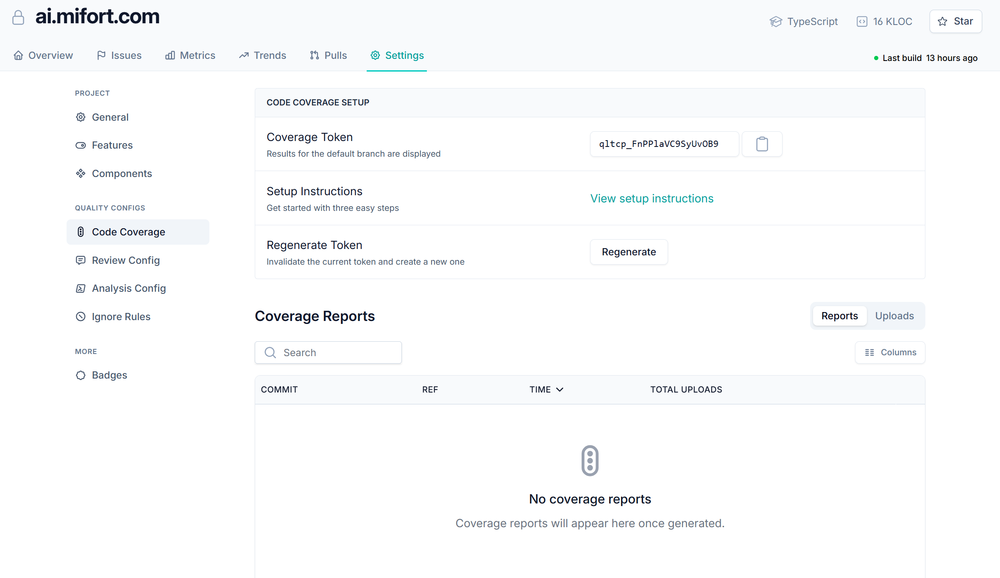

# Reference UI — Settings page (from screenshot)

Written breakdown of the reference screenshot ([`QualityDashboard-Settings.png`](QualityDashboard-Settings.png),
the ai.mifort.com Settings → Code Coverage view) so the design intent is captured in text as
well. Source image: 2359×1365.

## Top header bar
- Left: lock icon + **ai.mifort.com** (bold wordmark / logo).
- Right cluster: **TypeScript** badge (icon), **16 KLOC** badge (icon), **★ Star** button (outlined).
- Primary nav tabs (left→right), each with an icon: **Overview** (home), **Issues** (flag),
  **Metrics** (bar chart), **Trends** (trending-up), **Pulls** (git-pull), **Settings** (gear).
  The **Settings** tab is active — teal text with an underline.
- Under the nav, right-aligned: green dot + "**Last build** 13 hours ago".

## Left sidebar (Settings sub-navigation)
Grouped, with small grey section captions:
- **PROJECT**
  - General (gear icon)
  - Features (toggle/eye icon)
  - Components (nodes/diamond icon)
- **QUALITY CONFIGS**
  - **Code Coverage** — active item, highlighted pill background (paperclip icon)
  - Review Config (chat-bubble icon)
  - Analysis Config (code/terminal icon)
  - Ignore Rules (no-entry icon)
- **MORE**
  - Badges (hexagon icon)

## Main content — Code Coverage

### Card: "CODE COVERAGE SETUP"
Three stacked rows, each with a bold label + grey subtitle on the left and a control on the right:
1. **Coverage Token** — subtitle "Results for the default branch are displayed".
   Right: read-only text field showing a token (sample: `qltcp_FnPPlaVC9SyUvOB9`) + a copy
   (clipboard) icon button.
2. **Setup Instructions** — subtitle "Get started with three easy steps".
   Right: teal link "**View setup instructions**".
3. **Regenerate Token** — subtitle "Invalidate the current token and create a new one".
   Right: outlined "**Regenerate**" button.

### Section: "Coverage Reports"
- Heading "Coverage Reports" with a segmented toggle on the right: **Reports** (active) / **Uploads**.
- Toolbar row: a search input (placeholder "Search") on the left; a "**⋮≡ Columns**" button on the right.
- Table header columns: **COMMIT**, **REF**, **TIME** (with a sort caret ▾), **TOTAL UPLOADS**.
- Empty state (centered): a traffic-light style icon, "**No coverage reports**", and subtitle
  "Coverage reports will appear here once generated."

## Visual notes
- Light theme; teal/green accent for active nav, links, and the build-status dot.
- Generous whitespace, card + row separators, rounded controls.

> The reference screenshot is saved in this folder as [`QualityDashboard-Settings.png`](QualityDashboard-Settings.png)
> (embedded at the top of this file and in [00-task.md](00-task.md)).
