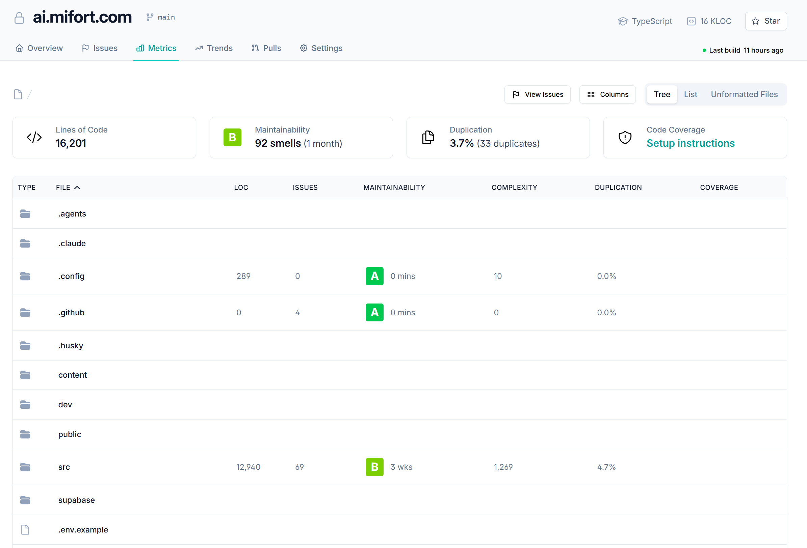
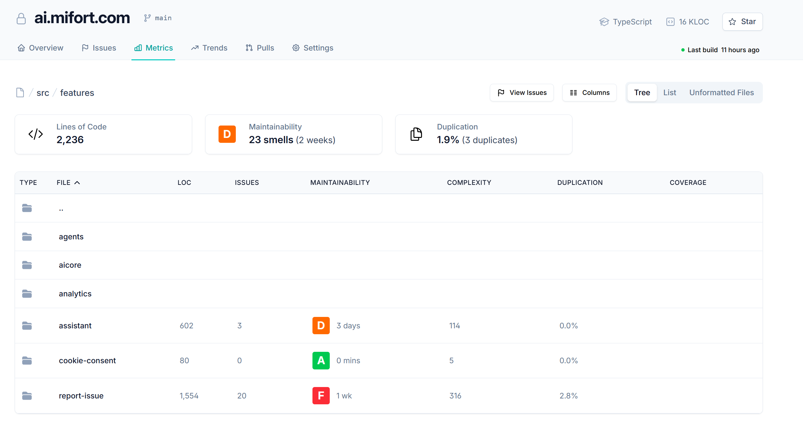

# Task: Add Metrics tab with file-tree navigation and per-file metrics
> Task: 6-metrics-tab | Issue: #6 https://github.com/AlexKolonitskyMifort/qmetrix/issues/6 | Date: 2026-06-30 | Type: enhancement | Priority: Normal | Found-in: 1.0.0

**Found in version:** 1.0.0

## Summary
Add a **Metrics** tab to the quality dashboard with a navigable source-file tree. Each
node (folder and file) shows all of its quality metrics inline — coverage and every issue
(bug/smell) found — so a reviewer can drill from the repo root down to a single file and
see that file's full metric profile in one place.

## Desired behavior
- A dedicated **Metrics** tab/view (alongside the existing dashboard surfaces).
- **Tree navigation over the consumer's sources**: start at repo root, click folders to
  descend, breadcrumb back up (e.g. `/ src / features`). The reference screenshots also
  show Tree / List / Unformatted-Files view toggles.
- **Per-row metrics** for each folder and file, as columns: LOC, Issues, Maintainability
  (grade A–F + estimated time-to-fix), Complexity, Duplication, and **Coverage**.
- **Summary cards** for the current tree level: Lines of Code, Maintainability (grade +
  smell count), Duplication (% + duplicate count), and Code Coverage.
- Coverage and the **full list of bugs/issues found** are surfaced per file — the two
  signals the request calls out explicitly.
- Reuses metrics QMetriX already collects (code, coverage, structural duplication/issues,
  maintainability) rather than recomputing them; degrades gracefully when a signal is
  missing (e.g. coverage shows a "Setup instructions" affordance instead of crashing).

## Undesired behavior
- A flat, un-navigable list with no folder drill-down / breadcrumb.
- A file row that hides its issues or coverage, forcing the user to look elsewhere.
- Hard-failing when one signal (coverage, duplication, …) is absent for a consumer.
- Reinventing per-file metric computation instead of consuming existing collector data.

## Context
- Fits the dashboard render layer: `src/dashboard/render/` consumes a data contract
  produced by `src/dashboard/collectors/*` (code, coverage, structural duplication/issues,
  and the maintainability metric from task #3). This view needs per-file granularity, so the
  collector→render contract likely needs a per-path metric breakdown.
- Related tasks: #3 (maintainability metric definition) feeds the Maintainability column;
  #2 (dogfood self-metrics) and #4 (persist metrics local store) are adjacent.
- **Reference screenshots** (UI to emulate — a code-quality dashboard "Metrics" tab) are
  embedded below and described in [references/REFERENCES.md](references/REFERENCES.md):
  [`QualityDashboard-Metrics.png`](references/QualityDashboard-Metrics.png) (repo root) and
  [`QualityDashboard-Metrics-02.png`](references/QualityDashboard-Metrics-02.png) (drilled into `src/features`).

## Original request
> добавь таб metrics где будет tree navigation по исходникам где в кажом файле показывают все необходимые метрики (покрытрие и все баги что найдены) см картинки (их нужно сохранить в папку задачи как референсы)

## Reference screenshots
**Metrics tab — repo root**

**Metrics tab — drilled into `src/features`**

