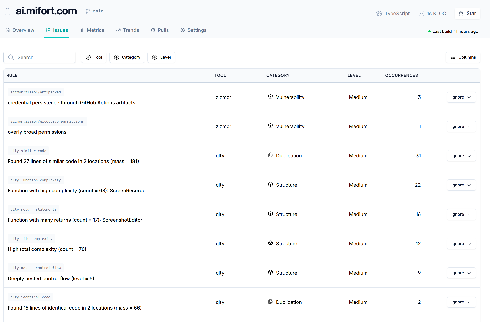

# Reference UI — Issues tab

> Written breakdown of the reference screenshot (ai.mifort.com → **Issues**), saved in this
> folder as [`QualityDashboard-issues.png`](QualityDashboard-issues.png) (embedded above and in
> [00-task.md](00-task.md)).

## Chrome / header
- Repo header: lock icon · **ai.mifort.com** · branch `main`. Right side: `TypeScript`, `16 KLOC`, **Star** button.
- Top nav tabs: **Overview · Issues (active) · Metrics · Trends · Pulls · Settings**.
- Status line (right): "● Last build 11 hours ago".

## Toolbar (above the table)
- **Search** input (left).
- Filter chips: **⊕ Tool**, **⊕ Category**, **⊕ Level**.
- **Columns** control (right) — show/hide columns.

## Table
Columns: **RULE · TOOL · CATEGORY · LEVEL · OCCURRENCES · (row action)**.
- **RULE** cell = a monospace rule-id badge on top + a human-readable title below.
- **CATEGORY** cells carry a small icon (shield = Vulnerability, overlapping-pages = Duplication, hexagon = Structure).
- Each row's right edge has an **Ignore ▾** dropdown action.

### Sample rows (from the screenshot)
| Rule id | Title | Tool | Category | Level | Occurrences |
| --- | --- | --- | --- | --- | --- |
| `zizmor:zizmor/artipacked` | credential persistence through GitHub Actions artifacts | zizmor | Vulnerability | Medium | 3 |
| `zizmor:zizmor/excessive-permissions` | overly broad permissions | zizmor | Vulnerability | Medium | 1 |
| `qlty:similar-code` | Found 27 lines of similar code in 2 locations (mass = 181) | qlty | Duplication | Medium | 31 |
| `qlty:function-complexity` | Function with high complexity (count = 68): ScreenRecorder | qlty | Structure | Medium | 22 |
| `qlty:return-statements` | Function with many returns (count = 17): ScreenshotEditor | qlty | Structure | Medium | 16 |
| `qlty:file-complexity` | High total complexity (count = 70) | qlty | Structure | Medium | 12 |
| `qlty:nested-control-flow` | Deeply nested control flow (level = 5) | qlty | Structure | Medium | 9 |
| `qlty:identical-code` | Found 15 lines of identical code in 2 locations (mass = 66) | qlty | Duplication | Medium | 2 |

## Observations for downstream stages
- Rows are **aggregated per rule**, not per individual finding — the per-finding instances roll up into the **Occurrences** count.
- Tools seen here: `zizmor` (CI/security) and `qlty` (duplication + structure). The design should accommodate more tools/categories without table changes.
- Categories observed: **Vulnerability**, **Duplication**, **Structure** (Level is severity, here all **Medium**).
- The **Ignore** action implies persisted suppression state — its storage/semantics are an open question for `/task-requirement` / `/task-design`.
