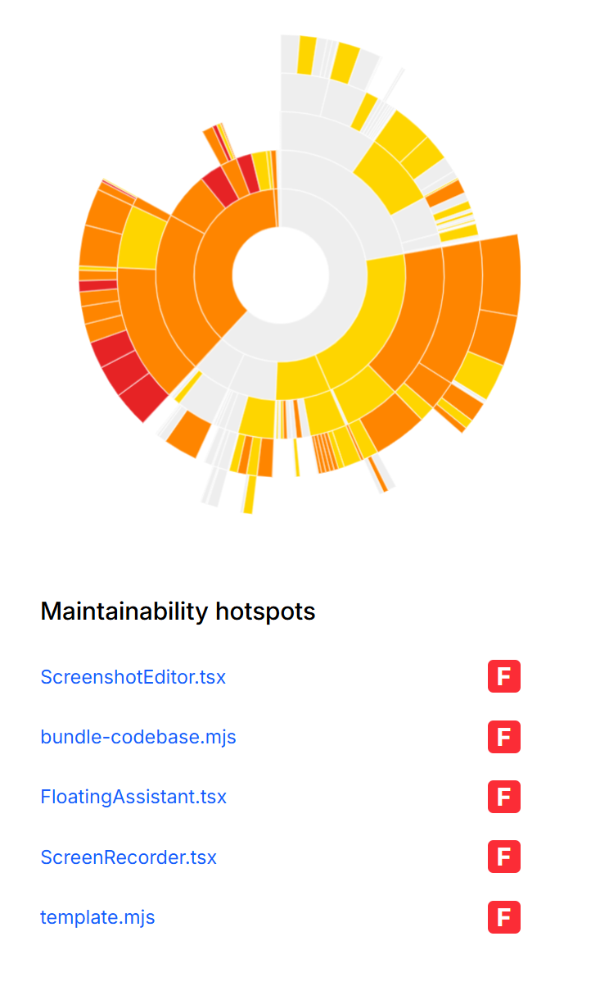

# Reference UI — Maintainability hotspots widget (from screenshot)

Written breakdown of the reference image (saved in this folder as
[`QualityDashboard-Hot.png`](QualityDashboard-Hot.png), embedded above and in
[00-task.md](00-task.md)). The widget has two stacked parts: a **sunburst chart** on top and a
**ranked hotspot list** below.

## Part 1 — Sunburst chart (top)
- A **zoomable sunburst / radial icicle**: concentric rings around a hollow centre. The innermost
  ring is the top-level directory; each outer ring is one directory level deeper; the outermost
  arcs are individual files.
- **Arc angle / size** ≈ a weight per node (looks like LOC or file size — bigger file = wider arc).
- **Arc colour** = maintainability grade, on a heat scale:
  - **grey / near-white** = good (best maintainability),
  - **yellow** → **orange** → **red** = progressively worse, red = worst hotspots.
- The chart is not a full circle — it spans most of the disc with a gap (a slice with no/low data),
  consistent with a partitioned hierarchy rather than a fixed 360°.
- Reads as a CodeScene / SonarQube-style "maintainability map": large red/orange regions draw the
  eye straight to the directories and files that need attention.

## Part 2 — Hotspot list (below the chart)
- Heading: **"Maintainability hotspots"** (bold, large).
- A vertical list of the worst-scoring files, one row each:
  - Left: the **file name as a link** (blue, e.g. `ScreenshotEditor.tsx`).
  - Right: a **letter-grade badge** — a rounded square chip; in the reference all five show **`F`**
    on a **red** background (worst grade). Grades range A (good) → F (worst); the badge colour
    should track the same heat scale as the sunburst.
- Rows shown in the reference (top 5, all grade F):
  1. `ScreenshotEditor.tsx`
  2. `bundle-codebase.mjs`
  3. `FloatingAssistant.tsx`
  4. `ScreenRecorder.tsx`
  5. `template.mjs`

## Visual notes
- Light theme, generous whitespace.
- Single accent: the red→orange→yellow→grey heat scale shared by the sunburst arcs and the list
  badges — colour is the only encoding of "how bad", so it must be consistent across both parts.
- File names are links (intended to jump to the file / its detail).

## Design implications (for /task-design)
- Data contract: a **hierarchy** (dir → dir → file tree) where each node carries a `weight`
  (size/LOC) and a `grade`/`score`, plus a flat **top-N hotspots** list derived from the leaves.
- Grade comes from the maintainability metric in **#3** — this widget consumes it, does not compute
  it.
- Prefer inline SVG for the sunburst over a charting dependency (keep the 3-runtime-dep budget).
