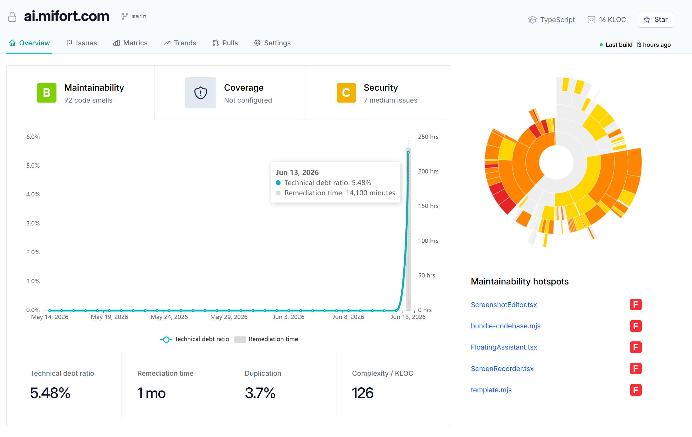

# Reference design — dashboard "Overview" layout

Element-by-element capture of the attached reference screenshot (saved in this folder as
[`QualityDashboard-Overview.png`](QualityDashboard-Overview.png), embedded above). Source
resolution 2378×1504. The design is a GitHub/SonarQube/CodeClimate-style project
**quality overview** page on a light theme.

## Overall structure
- Light theme, white cards on a faint grey page, rounded corners, subtle borders.
- A full-width **header**, a **tab bar** under it, then a two-column body:
  - **Left / main column** (~70%): rating cards row → trend chart → summary stat tiles.
  - **Right / sidebar** (~30%): radial map → maintainability hotspots list.

## Header bar
- Left: 🔒 lock icon, bold repo title **`ai.mifort.com`**, then a branch chip ` main`
  (branch/fork glyph + name).
- Right: 🎓 `TypeScript` (language), `</>` `16 KLOC` (size), outlined `☆ Star` button.

## Tab bar
- Tabs left→right: **Overview** (active — teal text + underline), `Issues` 🚩, `Metrics` 📊,
  `Trends` 📈, `Pulls`, `Settings` ⚙.
- Right-aligned: green status dot + `Last build  13 hours ago`.

## Rating cards row (3 cards, inside one bordered panel)
1. **Maintainability** — large green rounded badge **`B`**, subtitle `92 code smells`.
2. **Coverage** — grey shield-with-`!` icon, subtitle `Not configured` (the empty/soft-fail
   state).
3. **Security** — large amber rounded badge **`C`**, subtitle `7 medium issues`.

## Trend chart (main panel, below the cards)
- Dual-axis time-series.
  - **Left Y-axis**: percentage, `0.0%`–`6.0%` in 1% steps.
  - **Right Y-axis**: hours, `0 hrs`–`250 hrs` (50-hr steps).
  - **X-axis**: dates `May 14, 2026` … `Jun 13, 2026` (~5-day ticks).
- **Series A** — `Technical debt ratio`: teal line with circular node markers, flat near 0
  then a sharp spike at the right edge.
- **Series B** — `Remediation time`: light-grey filled area/bar, spiking at the right edge.
- **Hover tooltip** (shown on `Jun 13, 2026`): white card listing
  `Technical debt ratio: 5.48%` (teal dot) and `Remediation time: 14,100 minutes` (grey dot)
  with a dashed vertical guide line to the point.
- **Legend** below the chart: `—○— Technical debt ratio`  ·  `▭ Remediation time`.

## Summary stat tiles (4, row across the bottom of the main panel)
| Label | Value |
| --- | --- |
| Technical debt ratio | `5.48%` |
| Remediation time | `1 mo` |
| Duplication | `3.7%` |
| Complexity / KLOC | `126` |

Large bold value, small grey label above; thin vertical dividers between tiles.

## Right sidebar
- **Radial / sunburst map** — concentric rings representing the file/folder tree, each
  segment colored by maintainability grade on a **grey → yellow → orange → red** scale
  (worse = redder). Roughly a 270° fan with an empty wedge top-right and a hollow center.
- **Maintainability hotspots** — heading + vertical list of file links each trailed by a
  red **`F`** grade badge:
  1. `ScreenshotEditor.tsx` — F
  2. `bundle-codebase.mjs` — F
  3. `FloatingAssistant.tsx` — F
  4. `ScreenRecorder.tsx` — F
  5. `template.mjs` — F

## Grade / color system (used across cards, hotspots, radial map)
- Letter grades **A–F**; color scale green (A/B) → amber (C/D) → red (F).
- Badges are filled rounded squares with a white letter.

## Data-source mapping (every label is data, not a constant)
| UI element | Source signal (collector / report) |
| --- | --- |
| Repo name, branch | consumer `package.json` / git |
| Language, KLOC | `collectors/code` |
| Maintainability grade + code smells | `collectors/lint` / code metrics |
| Coverage card | `collectors/coverage` (→ "Not configured" when absent) |
| Security grade + issues | `collectors/security` |
| Technical debt / remediation trend | code metrics over history |
| Duplication | structural-duplication audit (`jsinspect`) |
| Complexity / KLOC | `collectors/code` |
| Radial map + hotspots | `collectors/entities` / `collectors/graph` |

> Coverage shows `Not configured` in the reference — the dashboard must keep that
> soft-fail/empty state for any signal a consumer hasn't wired up.
